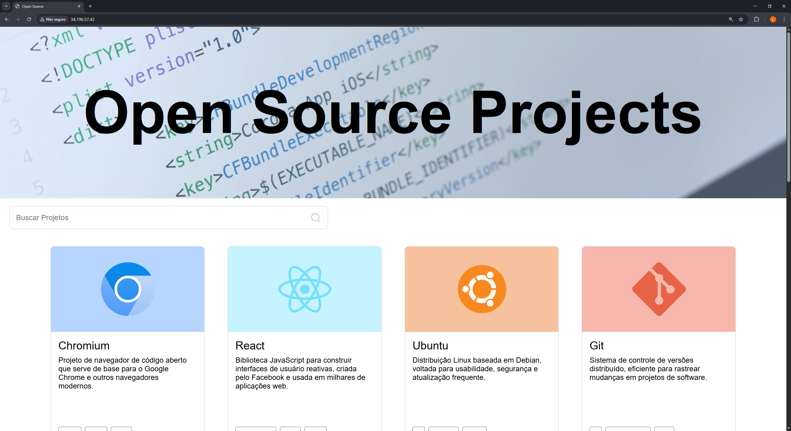
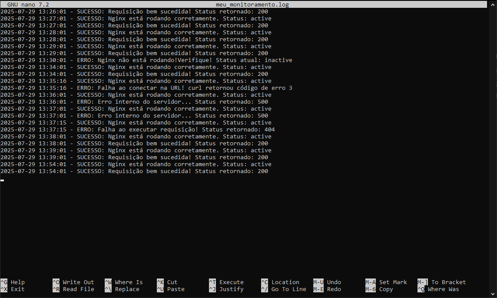
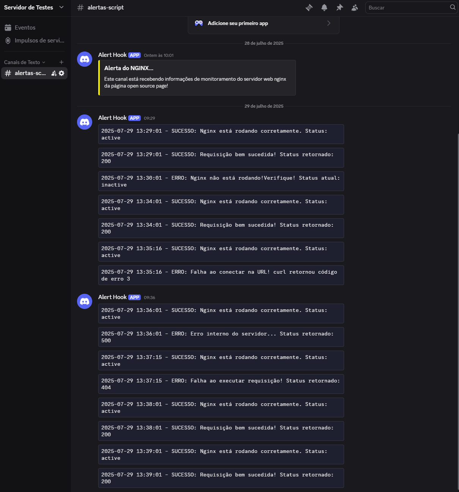

# Projeto AWS EC2 - Automação de Deploy e Monitoramento com Notificações


Este projeto demonstra a automação do deploy de uma página web em uma instância EC2 da AWS utilizando o recurso de **user-data**. Além da configuração automática do servidor NGINX, o projeto implementa um script de **monitoramento contínuo** da aplicação, com notificações enviadas em tempo real para um canal do Discord.

O objetivo é garantir alta disponibilidade da página e rápida detecção de falhas, mostrando domínio das ferramentas fundamentais da AWS, Linux, NGINX e scripts automatizados.

## 🛠 Tecnologias Utilizadas

- **Amazon EC2** — Instância virtual na nuvem com Ubuntu Server;
- **NGINX** — Servidor HTTP utilizado para hospedar a página web;
- **Git** — Utilizado para clonar o repositório da página durante o boot;
- **Shell Script** — Scripts automatizados para instalação, configuração e monitoramento;
- **Crontab** — Agendamento da execução periódica do script de monitoramento;
- **Webhook do Discord** — Canal para envio de mensagens com o status da aplicação;

## ✅ Pré-requisitos

Antes de executar este projeto, é necessário:

- Ter uma conta na **AWS** com permissões para criar e configurar instâncias EC2;
- Ter um **par de chaves SSH** (.pem) gerado para acesso remoto;
- Criar um webhook funcional em um canal do **Discord** (para receber notificações);
- Ter acesso ao repositório da página HTML hospedada no GitHub (ou utilizar o exemplo deste projeto);

## 🧱 Arquitetura da Solução

A solução foi construída para ser executada automaticamente no primeiro boot da instância EC2. O processo funciona da seguinte forma:

1. A instância EC2 é criada com Ubuntu Server e script `user-data`;
2. Durante a inicialização:
   - O sistema é atualizado;
   - NGINX é instalado e iniciado;
   - A página HTML é clonada do GitHub para `/var/www/html`;
3. Um script de monitoramento (`scriptMonitora.sh`) é criado em `/usr/local/bin`;
4. O script é executado automaticamente a cada minuto via `crontab`;
5. Logs são salvos localmente e notificações são enviadas ao Discord em caso de falha ou sucesso.

## ⚙️ Configuração da Instância EC2

A seguir estão os parâmetros utilizados na criação da instância EC2:

- **AMI**: Ubuntu Server 24.04 LTS (HVM), SSD Volume Type (x86);
- **Tipo de instância**: t2.micro (elegível para o Free Tier);
- **Armazenamento**: 8 GB SSD padrão;
- **Par de chaves (SSH)**: `projeto-monitoramento.pem` (exemplo de chave, coloque a sua);
- **Rede**: VPC padrão ou personalizada;
- **Subnet**: Pública (com acesso à internet);
- **Endereço IP elástico (EIP)**: Associado para manter o mesmo IP público fixo;
- **User Data**: Script de automação completo utilizado no primeiro boot da máquina;

Ao final da criação, um Elastic IP foi associado manualmente à instância para garantir um endereço público estático e permitir o monitoramento constante via URL.

## 🔐 Grupo de Segurança (Security Group)

O grupo de segurança foi configurado com as seguintes regras de entrada:

| Tipo       | Protocolo | Porta | Origem            | Descrição              |
|------------|-----------|-------|-------------------|------------------------|
| SSH        | TCP       | 22    | IP Pessoal (My IP)| Acesso remoto via SSH  |
| HTTP       | TCP       | 80    | 0.0.0.0/0         | Acesso público à página|

> ⚠️ Recomendado: restringir o acesso SSH apenas ao seu IP para maior segurança.

## 🔧 Etapa extra: Permitindo acesso ao IP da instância sem token (IMDSv1), para obter IP automaticamente

Os scripts utilizados neste projeto fazem requisição ao IP público da instância utilizando o serviço de metadados da AWS (IMDS), através do seguinte endereço:

```bash
http://169.254.169.254/latest/meta-data/public-ipv4
```

Por padrão, algumas instâncias exigem token (IMDSv2), o que bloqueia esse acesso direto via `curl`. Para permitir que o script funcione normalmente, é necessário ajustar a política de metadados da instância EC2, tornando o uso de token **opcional**.

---

### ✅ Como permitir IMDSv1 (sem token) no Console da AWS

1. Acesse o [Console da AWS](https://console.aws.amazon.com/)
2. Vá até **EC2 > Instâncias**
3. Selecione a instância EC2 usada no projeto
4. Clique em **Ações > Configurações de instância > Modificar opções de metadados da instância**
5. Na opção **IMDSv2** altere para **Opcional**
6. Clique em **Salvar** para aplicar as alterações e estará configurado!

## 📡 Script de Monitoramento (Webhook Discord)

Este script é executado periodicamente (a cada minuto) para verificar o funcionamento do servidor e da aplicação hospedada via Nginx. Em caso de sucesso ou falha, ele envia logs e notificações para um canal do Discord usando um Webhook.

### Caminho onde é salvo:
`/usr/local/bin/scriptMonitora.sh`

### Funcionalidades:

- Verifica se o serviço Nginx está ativo;
- Verifica se a página está respondendo (HTTP 200);
- Emite mensagens de erro para casos de falha (Nginx inativo, status HTTP diferente de 200, falha de conexão);
- Registra os resultados em um log local (`/var/log/meu_monitoramento.log`);
- Envia alertas automaticamente para um canal Discord via webhook.

### Código do Script:

```bash
#!/bin/bash

# Variavel que define o caminho de salvamento dos logs
LOG_FILE="/var/log/meu_monitoramento.log"

if [ ! -f  "$LOG_FILE" ]; then
    touch "$LOG_FILE"
fi

# Variavel para definir ip da requisicao automaticamente
IP_REQUEST=$(curl -s http://169.254.169.254/latest/meta-data/public-ipv4)
# URL do WEBHOOK
URL_WEBHOOK="https://discord.com/api/webhooks/SEU_WEBHOOK_AQUI"
# Variavel para armazenar data e ser reutilizavel
DATE=$(date '+%Y-%m-%d %H:%M:%S')

enviar_discord() {
  local MESSAGE=$1
  curl -s -H "Content-Type: application/json" \
       -X POST \
       -d "{\"content\": \"\`\`\`$MESSAGE\`\`\`\"}" \
       "$URL_WEBHOOK"
}

# Verificacao do status do serviço nginx
NGINX_STATUS=$(systemctl is-active nginx)

if [ "$NGINX_STATUS" != "active" ]; then
    MSG="$DATE - ERRO: Nginx não está rodando!Verifique! Status atual: $NGINX_STATUS"
    echo "$MSG" >> "$LOG_FILE"
    enviar_discord "$MSG"
    exit 1
else
    MSG="$DATE - SUCESSO: Nginx está rodando corretamente. Status: $NGINX_STATUS"
    echo "$MSG" >> "$LOG_FILE"
    enviar_discord "$MSG"
fi

# Variavel que ira guardar o resultado da requisicao
STATUS_CODE=$(curl -s -o /dev/null -w "%{http_code}" --connect-timeout 5 "http://$IP_REQUEST")
# Variavel para verificar sucesso de conexão
CURL_EXIT_CODE=$?

# Verificacao de conexao
if [ $CURL_EXIT_CODE -ne 0 ]; then
    MSG="$DATE - ERRO: Falha ao conectar na URL! curl retornou código de erro $CURL_EXIT_CODE"
    echo "$MSG" >> "$LOG_FILE"
    enviar_discord "$MSG"
    exit 1
elif [ "$STATUS_CODE" = "000" ]; then
    MSG="$DATE - ERRO: Nenhuma resposta HTTP recebida (status 000). Possível falha de conexão."
    echo "$MSG" >> "$LOG_FILE"
    enviar_discord "$MSG"
    exit 1
fi

# Verificacao das requisicoes
if [ "$STATUS_CODE" -eq 200 ]; then
    MSG="$DATE - SUCESSO: Requisição bem sucedida! Status retornado: $STATUS_CODE"
    echo "$MSG" >> "$LOG_FILE"
    enviar_discord "$MSG"
elif [ "$STATUS_CODE" -eq 500 ]; then
    MSG="$DATE - ERRO: Erro interno do servidor... Status retornado: $STATUS_CODE"
    echo "$MSG" >> "$LOG_FILE"
    enviar_discord "$MSG"
    exit 1
else
    MSG="$DATE - ERRO: Falha ao executar requisição! Status retornado: $STATUS_CODE"
    echo "$MSG" >> "$LOG_FILE"
    enviar_discord "$MSG"
    exit 1
fi
```

## 📝 Script de Inicialização (User Data)

O script `user-data` é utilizado no momento da criação da instância EC2 para automatizar toda a configuração inicial do servidor.

### Objetivos:

- Atualizar os pacotes do sistema;
- Instalar e configurar o Nginx;
- Clonar o repositório com a página HTML;
- Ajustar permissões de acesso;
- Instalar o script de monitoramento (`scriptMonitora.sh`);
- Configurar o agendamento com o `crontab`.

### Conteúdo do Script:

```bash
#!/bin/bash

# Script de automação com user-data

# Comando para atualizar pacotes
apt update && apt upgrade -y

# Instalação do git para clonar o repositório da página
apt install -y git

# Comandos para instalar o nginx e configurá-lo
apt install nginx -y
systemctl start nginx
systemctl enable nginx

# Remoção do arquivo padrão do nginx
rm -rf /var/www/html/*

# Clone da página html
git clone https://github.com/Luisdevux/openSourcePage.git /var/www/html/

# Configuração de permissões do nginx para garantir que tudo funcione corretamente
chown -R www-data:www-data /var/www/html
chmod -R 755 /var/www/html

# Reinicia o nginx para garantir que tudo carregue corretamente
systemctl restart nginx

# Script de monitoramento da página com sistema de envio de notificações para o Discord
cat << 'EOF' > /usr/local/bin/scriptMonitora.sh

#!/bin/bash

# Variavel que define o caminho de salvamento dos logs
LOG_FILE="/var/log/meu_monitoramento.log"

if [ ! -f  "$LOG_FILE" ]; then
    touch "$LOG_FILE"
fi

# Variavel para definir ip da requisicao automaticamente
IP_REQUEST=$(curl -s http://169.254.169.254/latest/meta-data/public-ipv4)
# URL do WEBHOOK
URL_WEBHOOK="https://discord.com/api/webhooks/SEU_WEBHOOK_AQUI"
# Variavel para armazenar data e ser reutilizavel
DATE=$(date '+%Y-%m-%d %H:%M:%S')

enviar_discord() {
  local MESSAGE=$1
  curl -s -H "Content-Type: application/json" \
       -X POST \
       -d "{\"content\": \"\`\`\`$MESSAGE\`\`\`\"}" \
       "$URL_WEBHOOK"
}

# Verificacao do status do serviço nginx
NGINX_STATUS=$(systemctl is-active nginx)

if [ "$NGINX_STATUS" != "active" ]; then
    MSG="$DATE - ERRO: Nginx não está rodando!Verifique! Status atual: $NGINX_STATUS"
    echo "$MSG" >> "$LOG_FILE"
    enviar_discord "$MSG"
    exit 1
else
    MSG="$DATE - SUCESSO: Nginx está rodando corretamente. Status: $NGINX_STATUS"
    echo "$MSG" >> "$LOG_FILE"
    enviar_discord "$MSG"
fi

# Variavel que ira guardar o resultado da requisicao
STATUS_CODE=$(curl -s -o /dev/null -w "%{http_code}" --connect-timeout 5 "http://$IP_REQUEST")
# Variavel para verificar sucesso de conexão
CURL_EXIT_CODE=$?

# Verificação de conexao
if [ $CURL_EXIT_CODE -ne 0 ]; then
    MSG="$DATE - ERRO: Falha ao conectar na URL! curl retornou código de erro $CURL_EXIT_CODE"
    echo "$MSG" >> "$LOG_FILE"
    enviar_discord "$MSG"
    exit 1
elif [ "$STATUS_CODE" = "000" ]; then
    MSG="$DATE - ERRO: Nenhuma resposta HTTP recebida (status 000). Possível falha de conexão."
    echo "$MSG" >> "$LOG_FILE"
    enviar_discord "$MSG"
    exit 1
fi

# Verificacao das requisicoes
if [ "$STATUS_CODE" -eq 200 ]; then
    MSG="$DATE - SUCESSO: Requisição bem sucedida! Status retornado: $STATUS_CODE"
    echo "$MSG" >> "$LOG_FILE"
    enviar_discord "$MSG"
elif [ "$STATUS_CODE" -eq 500 ]; then
    MSG="$DATE - ERRO: Erro interno do servidor... Status retornado: $STATUS_CODE"
    echo "$MSG" >> "$LOG_FILE"
    enviar_discord "$MSG"
    exit 1
else
    MSG="$DATE - ERRO: Falha ao executar requisição! Status retornado: $STATUS_CODE"
    echo "$MSG" >> "$LOG_FILE"
    enviar_discord "$MSG"
    exit 1
fi
EOF

# Comando para dar a permissão de execução do script
chmod +x /usr/local/bin/scriptMonitora.sh

# Automatiza o processo de monitoramento com crontab
(crontab -l 2>/dev/null; echo "* * * * * /usr/local/bin/scriptMonitora.sh") | crontab -
```

## 🧪 Exemplos de Funcionamento:

### 🖥️ Página Web Ativa (Deploy Realizado com Sucesso)

- A página clonada do repositório é exibida corretamente ao acessar o IP público da instância.



### 📄 Registro de Logs Locais

- O script salva os logs de verificação no arquivo /var/log/meu_monitoramento.log, registrando tanto falhas quanto sucessos, com data e hora.



### 📢 Notificações no Discord

- Cada execução do script envia mensagens automáticas para um canal do Discord, notificando falhas (como servidor NGINX inativo ou erro de conexão) ou sucesso no acesso à página.



---

> ### Este projeto está licenciado sob a [Licença MIT](./LICENSE).